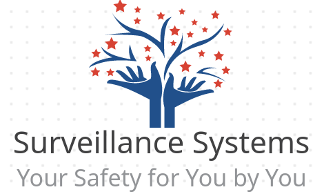
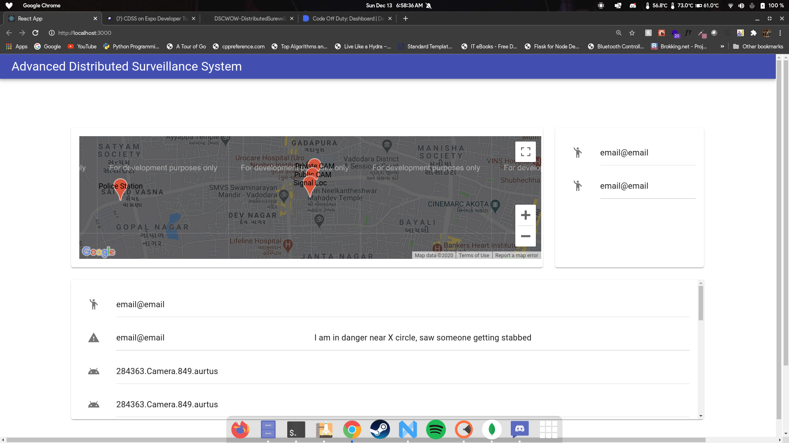
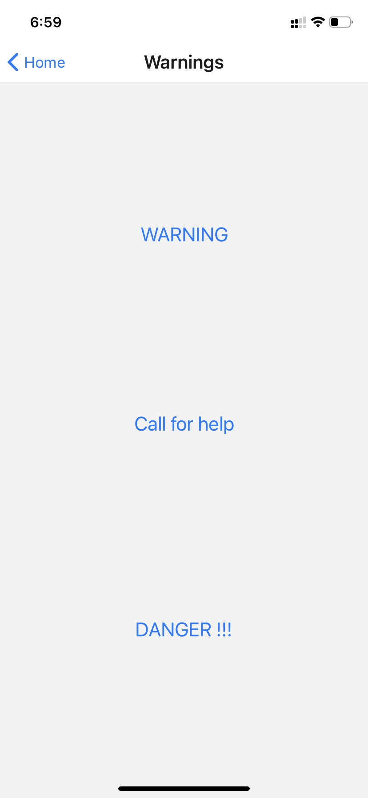
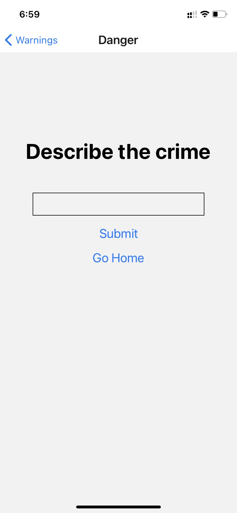
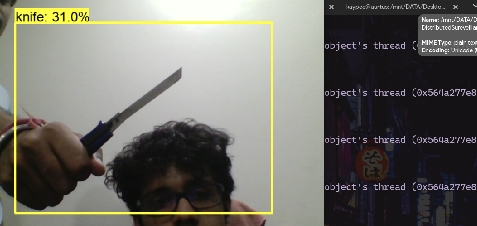

# DSCWOW-DistributedSureveillanceSystem



Repository for Distributed Surveillance System Project Created at DSC WOW Code Off Duty Hackathon.

[Video Demonstration of this project](https://youtu.be/-DlXvhqaOBI)

## Instruction to Run

### Running Node Backend Server 

```
cd ADSS_Node_Server
npm i
npm run dev
```

### Running Native APP in dev mode

```
cd ADSS_Phone_App
npm i
npm start
```

### Running Frontend Dashboard

```
git submodule init
git submodule update
cd DSCWOW-DSS_Dashboard_FE
cd dss_dashboard
npm start
```

## Running Python Object Detection Script for Guns and Knives
detects guns and knives and sends signals to node server
```
Make sure you install all the requires models files from our drive link and follow the instructruction there(tobe updated soon)
cd DL_Weapons_Detection
cd Training_Final
python detectobject.py
```

## Problem

It is very difficult to utilize all the public surveillance capabilities of a big city and often time pre symptoms of crime or very big give away factors are missed due to the fact that not everyone can man public cameras or keep an eye on everyone physically. This leads to blind spots for the security bodies to functions and in turn, these blind spots are exploited by anti-social elements of the society. These blind spots can be avoided and there can be warnings given ahead of time of a crime by looking at pre symptoms of a crime (or situations that lead to crime) or there can also be sure sign warnings that prompt for quick action from the Police or any security body.

All this can be done by developing a distributed surveillance system that takes signals from two of the smartest beings on earth that are capable of detecting pre symptoms as well as sure sign signals of crime.

Humans
AI
We have tried to do just this by combining user warnings and feedbacks with our trained AI. The whole system if we let it scale can make neighbourhoods super safe and can also lead to a reduction in action to emergency time as this can prompt actions to be taken before an event occurs.

To sum it up, We are trying to be your neighbourhood friendly spider man but with a catch that we would be working for the security body and use our spidey sense to inform them about any anti-social activity that may be going on in their neighbourhood. This would make the city safer and the job of the police/security body a little bit easier(or so we hope).

## Architecture and Wireframes










